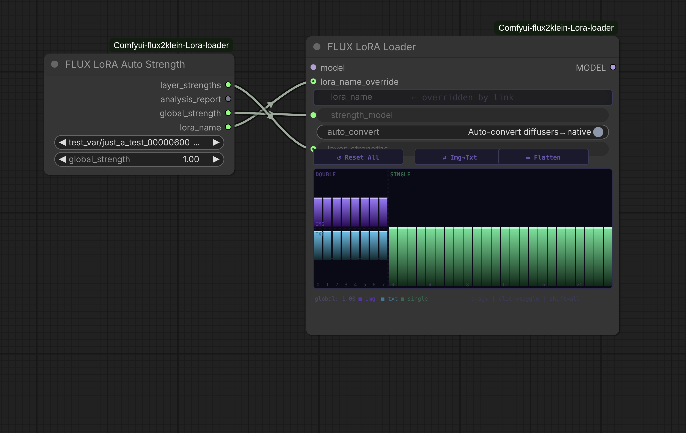

# ComfyUI FLUX.2 Klein LoRA Loader
[](https://buymeacoffee.com/capitan01r)
[](LICENSE)

Architecture-aware LoRA loading for **FLUX.2 Klein** (9B) in ComfyUI, with automatic per-layer strength calibration based on forensic weight analysis and **semantic edit-mode presets** for identity-preserving image editing.


## Background

LoRAs trained against FLUX models are commonly shipped in diffusers format — separate `to_q`, `to_k`, `to_v` projections per attention layer. FLUX's native architecture stores these as a single fused QKV matrix, and single blocks fuse attention and MLP gate into a single `linear1` projection. Loading these LoRAs without conversion means most attention weights never reach the model.

| What the LoRA ships with | What FLUX expects | What this pack does |
|---|---|---|
| Separate `to_q` / `to_k` / `to_v` | Fused `img_attn.qkv` / `txt_attn.qkv` | Block-diagonal fusion at load time |
| Separate single block components | Fused `linear1` `[36864, 4096]` | Fuses `[q, k, v, proj_mlp]` correctly |
| Global strength only | Independent img/txt + per-single-block | Interactive graph widget + auto-calibration |
| LoRA affects everything equally | Different layers control different aspects | **Edit-mode presets** for selective control |

## Installation

```bash
cd ComfyUI/custom_nodes
git clone https://github.com/TuZZiL/Comfyui-flux2klein-Lora-loader.git
```

## Nodes

### FLUX LoRA Loader

| Input | Type | Description |
|---|---|---|
| `model` | MODEL | FLUX.2 Klein / FLUX.1 model |
| `lora_name` | dropdown | LoRA file from `models/loras` |
| `strength_model` | float | Global LoRA strength (-20.0 to 20.0) |
| `auto_convert` | boolean | Convert diffusers-format LoRAs to native FLUX format |
| `edit_mode` | dropdown | Semantic edit preset (see below) |
| `balance` | float | 0.0 = full preset effect, 1.0 = standard LoRA (0.0 to 1.0) |
| `lora_name_override` | string (link) | Optional — overrides the dropdown when connected |
| `layer_strengths` | string (link) | Optional — per-layer JSON from Auto Strength node |

The graph widget shows double blocks (8 columns, img purple / txt teal, split top/bottom) and single blocks (24 columns, green). Drag to adjust. Shift-drag moves all bars in a section. Global strength shown as a reference line.

### FLUX LoRA Stack
Apply up to 10 LoRAs in sequence with independent strength, enable toggle, and auto-convert per slot. Supports global `edit_mode` and `balance` applied to all slots.

### FLUX LoRA Auto Strength
Reads the LoRA's weight tensors directly and computes per-layer strengths from the actual training signal in the file. Double blocks are analyzed with img and txt streams independently. One knob: `global_strength`.

### FLUX LoRA Auto Loader
Self-contained version of the above — analysis and application in one node. `model` in, patched `model` out.

## Edit Mode Presets

When using LoRAs for image editing (e.g., changing clothing on a reference photo), the LoRA can corrupt parts of the image you want to preserve — most commonly the face/identity. This happens because FLUX.2 Klein processes image and text in different ways across its layers:

- **Double blocks (0-7):** Image and text streams are isolated — they can't cause text-driven image corruption on their own.
- **Single blocks (0-23):** Joint cross-modal processing — this is where the text prompt overwrites the reference image. Late single blocks (12-23) are the most aggressive.

The `edit_mode` dropdown provides ready-made per-layer weight profiles:

| Preset | What it does | Use case |
|---|---|---|
| **None** | Standard LoRA (all layers equal) | Default behavior |
| **Preserve Face** | Dampens late single blocks, keeps img stream intact | Editing while keeping face/identity |
| **Style Only** | Reduces img stream in double blocks, dampens late singles | Applying style changes without structural edits |
| **Edit Subject** | Moderate protection on late blocks, slight txt boost | Changing clothing/objects while preserving identity |
| **Boost Prompt** | Strengthens txt stream and mid single blocks | When the prompt isn't being followed strongly enough |

The `balance` slider interpolates between the preset and standard behavior:
- **0.0** — full preset effect (maximum protection/boost)
- **0.5** — halfway between preset and standard
- **1.0** — standard LoRA (preset has no effect)

Edit mode works on top of Auto Strength — you can combine automatic ΔW-based calibration with semantic presets.

## How Auto Strength works

For every layer pair in the file:

```
ΔW = lora_B @ lora_A
scaled_norm = frobenius_norm(ΔW) * (alpha / rank)
strength = clamp(global * (mean_norm / layer_norm), floor=0.30, ceiling=1.50)
```

Double blocks are processed with img and txt streams independently. Mean layer lands at `global_strength`.

## Diffusers format fusion math

```
A_fused = cat([A_q, A_k, A_v], dim=0)          [3r × in]
B_fused = block_diag(B_q, B_k, B_v)            [3·out × 3r]
```

Alpha/rank scaling is pre-baked into `B_fused` before patching.

## FLUX.2 Klein Architecture Reference

```
Double blocks (8 layers)
  img stream:
    img_attn.qkv    [12288, 4096]  (fused Q+K+V)
    img_attn.proj   [4096, 4096]
    img_mlp.0       [24576, 4096]
    img_mlp.2       [4096, 12288]
  txt stream:
    txt_attn.qkv    [12288, 4096]
    txt_attn.proj   [4096, 4096]
    txt_mlp.0       [24576, 4096]
    txt_mlp.2       [4096, 12288]

Single blocks (24 layers)
  linear1    [36864, 4096]  (fused Q+K+V+proj_mlp)
  linear2    [4096, 16384]

dim=4096  double_blocks=8  single_blocks=24
```

## Credits

- Original node pack by [capitan01R](https://github.com/capitan01R/Comfyui-flux2klein-Lora-loader)
- Edit-mode presets based on architecture research from [comfyUI-Realtime-Lora](https://github.com/shootthesound/comfyUI-Realtime-Lora) (Klein 9B debiaser / layer mapping)
